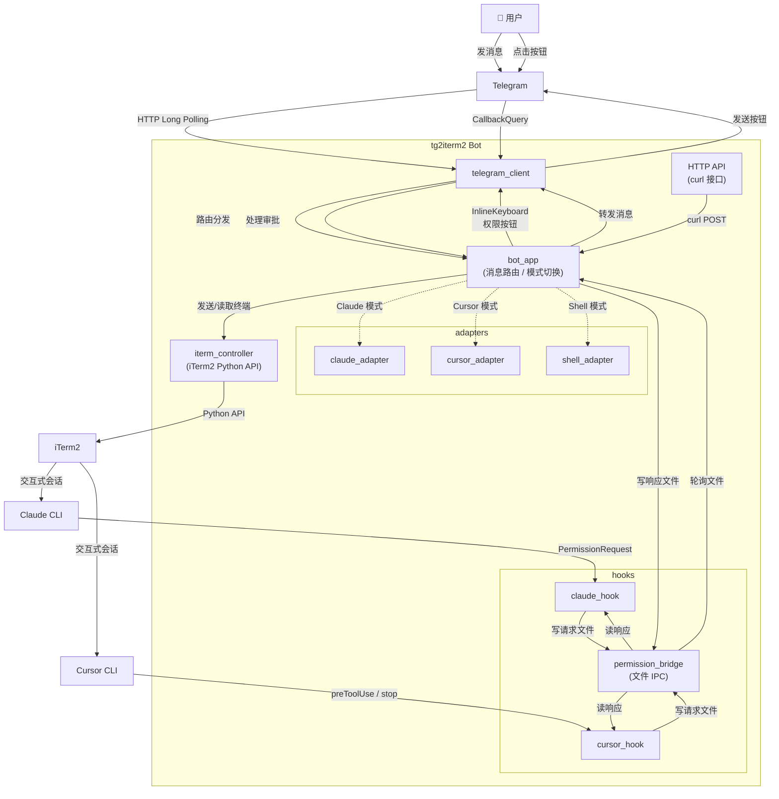

# tg2iterm2

通过 Telegram Bot 远程控制 macOS 上的 iTerm2 终端。支持命令执行、流式输出、文件收发、图片传递，以及 Claude Code / Cursor CLI 的远程交互和权限审批。

## 架构



### 数据流

```
用户 ──► Telegram ──► telegram_client ──► bot_app ──► iterm_controller ──► iTerm2
                                            │                                 │
                                            ▼                                 ▼
                                     adapter (解析TUI)              Claude / Cursor CLI
                                            │                                 │
                                            ▼                                 ▼
                                     permission_bridge ◄──── hook 脚本 ◄──── CLI 权限请求
                                            │
                                            ▼
                                     Telegram InlineKeyboard ──► 用户审批

服务端 ──► curl POST http://127.0.0.1:7288/send ──► bot_app ──► Telegram
```

## 功能

- 通过 Telegram 发送文本直接在 iTerm2 中执行命令
- 命令输出实时流式回传到 Telegram 消息（自动编辑更新）
- 多 Tab 管理：列出、切换、新建 iTerm2 tab
- 发送图片到终端（保存为临时文件，路径自动前置到下一条文本命令）
- 前台交互命令支持：运行中的命令可继续接收 stdin 输入
- 发送控制键：Ctrl+C、Ctrl+D、Enter
- **多模式切换**：Shell / Claude / Cursor 三种模式
- **Claude Code 集成**：进入 Claude 模式后与 Claude CLI 交互，权限请求通过 TG 按钮远程审批
- **Cursor CLI 集成**：进入 Cursor 模式后与 Cursor agent 交互，权限请求通过 TG 按钮远程审批
- **动态 Bot 菜单**：根据当前模式动态显示可用的 skill/斜杠命令
- **文件发送**：通过 Inline Keyboard 浏览本机目录或输入路径，将文件/图片发送到 Telegram；文件夹自动打包 tar.gz，大文件自动分片
- **文件接收**：用户通过 Telegram 发送文件到本机 `~/Downloads` 目录
- **HTTP API**：本地 HTTP 接口，服务端可通过 curl 发送文本到 Telegram
- **CLI 输出图片自动发送**：CLI 回复中包含本机图片路径时，自动将图片发送到 Telegram
- **定时提醒**：通过 Bot 菜单进入提醒模式，支持自然语言创建提醒（如"每周三晚上8点提醒我自驾游"），支持单点、周期、复杂定时（每月第N个星期X），提醒数据持久化存储

## 环境要求

- macOS（依赖 iTerm2 Python API）
- Python 3.11+
- iTerm2
- 依赖包：`aiohttp`、`iterm2`

## 首次配置

### 1. iTerm2 开启 Python API

打开 iTerm2，进入：

```
Preferences → General → Magic → 勾选 "Enable Python API"
```

如果找不到该选项，确认 iTerm2 版本 >= 3.3。

### 2. 安装 Shell Integration（推荐）

Shell Integration 让 bot 能精确识别每条命令的输出范围，而不是靠屏幕文本匹配。

在 iTerm2 中执行：

```bash
curl -L https://iterm2.com/shell_integration/install_shell_integration.sh | bash
```

安装后重启终端，命令行左侧出现蓝色三角标记即为成功。

### 3. 配置环境变量

```bash
export TG_BOT_TOKEN="your-bot-token"
export TG_ALLOWED_CHAT_ID="your-chat-id"
```

| 变量名 | 必填 | 说明 |
|--------|------|------|
| `TG_BOT_TOKEN` | 是 | Telegram Bot Token |
| `TG_ALLOWED_CHAT_ID` | 是 | 允许操作的 Telegram Chat ID（仅私聊） |
| `TG_DEFAULT_TAB_NUMBER` | 否 | 默认操作的 tab 编号 |
| `TG_STREAM_INTERVAL` | 否 | 流式输出刷新间隔，默认 `15.0` 秒 |
| `TG_CLAUDE_DONE_SIGNAL` | 否 | Claude 完成信号文件路径 |
| `TG_CLAUDE_HOOK_TIMEOUT` | 否 | Claude hook 等待超时，默认 `300.0` 秒 |
| `TG_PERM_REQUEST_PATH` | 否 | 权限请求文件路径 |
| `TG_PERM_RESPONSE_PATH` | 否 | 权限响应文件路径 |
| `TG_PERM_POLL_INTERVAL` | 否 | 权限文件轮询间隔，默认 `0.5` 秒 |
| `TG_HTTP_API_PORT` | 否 | HTTP API 监听端口，默认 `7288` |
| `TG_REMINDER_DB_PATH` | 否 | 提醒数据库路径，默认 `~/.tg2iterm2/reminders.db` |

### 4. 安装 Hooks（Claude / Cursor 权限审批）

Hooks 让 Claude CLI 和 Cursor CLI 的权限请求（执行命令、修改文件等）转发到 Telegram，由你远程点击按钮审批。

```bash
cd tg2iterm2
bash hooks/install_hooks.sh
```

脚本会自动：

- **Claude**：在 `~/.claude/settings.json` 注册 `PermissionRequest` hook，指向 `hooks/claude_hook.py`
- **Cursor**：在 `~/.cursor/hooks.json` 注册 `preToolUse` 和 `stop` hook，指向 `hooks/cursor_hook.py`

安装完成后需要**重启 Claude Code / Cursor** 才能生效。

#### 手动安装（可选）

如果不想用脚本，可以手动配置：

**Claude** — 编辑 `~/.claude/settings.json`：

```json
{
  "hooks": {
    "PermissionRequest": [
      {
        "matcher": "",
        "hooks": [
          {
            "type": "command",
            "command": "/绝对路径/tg2iterm2/hooks/claude_hook.py"
          }
        ]
      }
    ]
  }
}
```

**Cursor** — 编辑 `~/.cursor/hooks.json`：

```json
{
  "version": 1,
  "hooks": {
    "preToolUse": [
      {
        "command": "/绝对路径/tg2iterm2/hooks/cursor_hook.py",
        "matcher": "Shell|Write|Edit|Delete"
      }
    ],
    "stop": [
      {
        "command": "/绝对路径/tg2iterm2/hooks/cursor_hook.py"
      }
    ]
  }
}
```

### 5. 启动

```bash
python tg2iterm2.py
```

启动后会同时监听：
- Telegram 长轮询（接收用户消息）
- 本地 HTTP API（`http://127.0.0.1:7288`，接收 curl 请求）

## Bot 命令

### 模式切换

| 命令 | 说明 |
|------|------|
| `/claude` | 进入 Claude 模式（在 iTerm2 中启动 Claude CLI） |
| `/claude <prompt>` | 进入 Claude 模式并发送首条消息 |
| `/cursor` | 进入 Cursor 模式（在 iTerm2 中启动 Cursor agent） |
| `/cursor <prompt>` | 进入 Cursor 模式并发送首条消息 |
| `/exit` | 退出当前 CLI 模式，回到 Shell |
| `/new` | 重置当前 CLI 会话 |

### iTerm2 控制（任何模式下可用）

| 命令 | 说明 |
|------|------|
| `/help` | 显示帮助信息 |
| `/tabs` | 列出 iTerm2 所有 tab |
| `/use_tab <编号>` | 切换默认操作的 tab |
| `/new_tab` | 新建 tab 并切换 |
| `/send <text>` | 只输入文本，不按回车 |
| `/enter` | 只发送回车键 |
| `/ctrl_c` | 发送 Ctrl+C |
| `/ctrl_d` | 发送 Ctrl+D |
| `/last <n>` | 获取终端倒数 N 行内容 |

### 文件收发

| 命令 | 说明 |
|------|------|
| `/fetch_file_or_dir` | 从本机发送文件/图片到 Telegram（支持输入路径或目录浏览） |
| `/send_2_server` | 进入文件接收模式，用户发送的文件/图片保存到 `~/Downloads` |
| `/stop_receive` | 退出文件接收模式 |

`/fetch_file_or_dir` 提供两种选择方式：
1. **输入路径** — 直接输入文件或目录的完整路径
2. **目录浏览** — 通过 Inline Keyboard 从根目录逐级浏览，点击选中后确认发送

自动识别：图片用 `sendPhoto`（可预览），其他文件用 `sendDocument`，文件夹自动打包 `tar.gz`，超过 49MB 自动分片发送。

### 定时提醒

通过 `/reminder` 命令或 Bot 菜单进入提醒模式，支持自然语言创建提醒：

```
用户: 每周三晚上8点提醒我自驾游
Bot: 已创建提醒
     内容：自驾游
     时间：每周三 20:00
```

**支持的定时格式**：
- 单点定时：`2026-05-15 10:00 提醒我开会`
- 周期定时：`每天22点提醒我跑步`、`每周三20点提醒我...`
- 复杂定时：`每月第二个星期日提醒我...`（支持排除特定月份）

**提醒管理**：
- 查看列表、暂停、恢复、编辑、删除
- 数据持久化存储，重启后自动恢复

### HTTP API（curl 接口）

Bot 启动后监听本地 `127.0.0.1:7288`，服务端脚本可通过 curl 发送文本到 Telegram：

```bash
# form 表单方式
curl -X POST http://127.0.0.1:7288/send -d 'message=部署完成'

# JSON 方式
curl -X POST http://127.0.0.1:7288/send \
  -H 'Content-Type: application/json' \
  -d '{"message":"构建失败，请检查日志"}'
```

端口可通过 `TG_HTTP_API_PORT` 环境变量自定义。

### 使用方式

**Shell 模式（默认）**：直接发送普通文本会在当前 tab 中执行（自动追加回车）。

**Claude/Cursor 模式**：进入后所有文本直接发送到对应 CLI 作为对话输入，Bot 流式返回 CLI 的回复。

## 项目结构

```
tg2iterm2.py            # 启动入口
config.py               # 环境变量配置加载
bot_app.py              # Telegram 消息路由、模式切换、流式任务管理、HTTP API
telegram_client.py      # Telegram Bot API 异步客户端（含 sendPhoto/sendDocument）
telegram_format.py      # Markdown → Telegram Entities 转换
iterm_controller.py     # iTerm2 Python API 控制封装
adapters/
  base.py               # InteractiveAdapter 抽象基类
  claude_adapter.py     # Claude CLI TUI 解析（回合完成检测、输出清理）
  cursor_adapter.py     # Cursor CLI TUI 解析（回合完成检测、输出清理）
  shell_adapter.py      # 普通 Shell 命令执行封装
reminder/
  __init__.py           # 模块入口
  models.py             # Reminder 数据模型
  manager.py            # ReminderManager（封装 APScheduler）
  parser.py             # 自然语言解析器
  triggers.py           # 自定义 Trigger（NthWeekdayTrigger）
  ui.py                 # InlineKeyboard UI 生成
  handlers.py           # 提醒模式处理方法
hooks/
  permission_bridge.py  # 通用权限弹窗桥接（文件 IPC）
  claude_hook.py        # Claude PermissionRequest hook 脚本
  cursor_hook.py        # Cursor preToolUse / stop hook 脚本
  install_hooks.sh      # 一键安装 hooks
run_tests.py            # 本地测试
```
